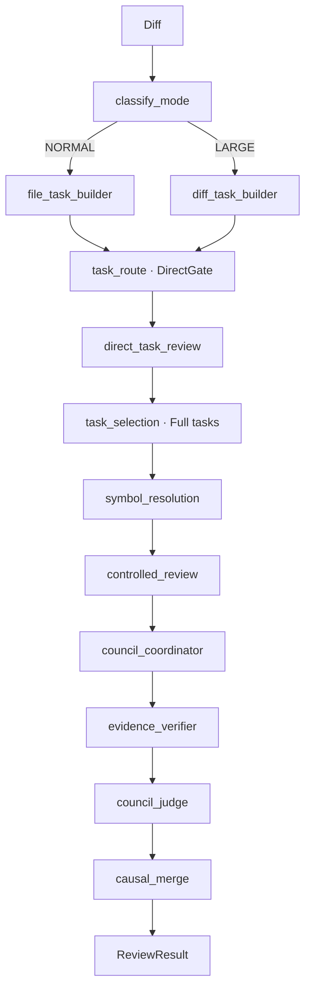

# AGENTS.md

Codeguard 是 Python Agent + Java Gateway 的 AI PR 审查项目。先读本文件，再读 `README.md`；历史 ADR 记录演进，不能代替当前入口代码。

## 1. 当前架构

默认是变更声明驱动的有界 ReAct，另保留显式 `direct` 无工具对照。旧三维发现者、Plan、Summary、DirectTriage、GraphPlan、固定步骤执行器及其运行配置已移除，不恢复兼容入口。



| 节点 | 职责 |
|---|---|
| `classify_mode` | 按 diff 规模决定文件或 hunk 粒度，不调用模型。 |
| `file_task_builder` / `diff_task_builder` | 构建文件任务 / hunk 任务，保存变更行与删除锚点。 |
| `task_route` | DirectGate 确定性区分低风险文档/注释任务与 Full 任务。 |
| `direct_task_review` | 仅处理 Direct 任务；节点内完成直审、定位和裁决，暂存独立结果。 |
| `task_selection` | 选择 Full 任务并记录大 diff 截断，不调用风险分类模型。 |
| `symbol_resolution` | 通过 Gateway 批量解析变更位置，获得真实符号和导航上下文。 |
| `controlled_review` | 按变更声明分组、预取上下文，运行有界 ReAct；节点内完成候选定位与账本绑定。 |
| `council_coordinator` | 汇总和归并候选，准备后续验证的候选集合。 |
| `evidence_verifier` | 零 LLM 校验证据内容、revision、符号范围及图谱合同；仅对可恢复失败重放。 |
| `council_judge` | 按批判断候选是否由有效证据支持，给出去留和定级；不补查工具。 |
| `causal_merge` | 对保留候选做根因分析与保守合并，合入 Direct 结果。 |

Direct 与 Full 是任务类别；外层图先处理 Direct 再处理 Full，并非两个并行子图。NORMAL 按文件，LARGE 按 hunk。主入口是 `pipeline/orchestration/graph.py:build_review_graph`。

## 2. 调查与证据合同

- `pipeline/controlled/change_review.py` 按实际新增行/删除锚点的真实声明分组，每组最多 4 个符号。缺失解析与覆盖截断必须记录，不猜测符号 ID。
- 源码与一跳关系预取在子任务超时和工具预算内。默认 10 次工具尝试，源码最多占一半，总预取最多 6 次，保留至少 4 次动态查询；关系 limit=6，不自动追分页。每组最多 6 次探索决策，另最多一次原历史内的无工具结论；task 总工具预算 32，最多 8 组。
- `subtask_react.py` 只暴露 `read_symbol`、`query_relations`。模型每轮 queries/result 二选一，最多两个独立查询；结果最多 8 findings，每条最多 3 观察引用。观察引用必须是本组真实 Txx，patch 运行时自动绑定。查询必须说明 `fact_question`，此说明不作为事实。
- `resolve_change_context` 仅由运行时调用。关系支持 callers/callees/field_readers/field_writers/implementations/overrides。返回真实 canonical ID 后才可继续探索，不从源码文本猜 ID。
- 空的完整关系关闭该查询，局部连续两次无进展关闭该查询，全局连续四次无进展终止取证。预算、超时、覆盖不足不等于安全。预取不计入模型无进展计数。禁止收口后再次查询或另开 Catalog synthesis。
- `query_relations` 模型视图附带 `new_queryable_symbols`，仅含本次新进入本组可见导航范围的 ID；不是证据或必查列表，跨组缓存复用仍独立计算。
- 工具原文进入内容寻址 Evidence Ledger，State 的工具轨迹只存 `ToolTraceRef`。每组历史与证据编号独立，单次审查共享工具缓存，跨审查不共享。
- Gateway graph schema v2 只返回当前 source_scope 的 symbols/relationships/unresolved_relationships；partial 支持已知正事实，不能证明关系不存在。源码片段不得逃逸声明和 revision；MAIN/TEST/GENERATED 不混用。
- 受控候选定位是确定性的：新增行原文片段与删除锚点，失败保留 line=0 与限制，不额外请求模型定位。Direct 分支仍有自身定位与裁决。
- Verifier 零 LLM，只验证证据真实可用且范围正确，不判断漏洞。Judge 每批最多 8 个候选，引用可见支持事实、合同校验、失败关闭；不补证。因果合并只处理已保留候选。
- 同步 HTTP 有请求超时；Future.cancel 不能中断已运行线程。超时关闭客户端并阻止后续模型/工具调用，在途请求靠自身超时返回。

## 3. 模块边界与目录

Python 负责推理、分组、预算、证据加工与裁决。Java 负责 Git workspace/revision 沙箱、AST/调用图、缓存和静态事实，不判断“是不是 bug”。代码探索仅通过 Java 工具；Python 可采集 diff。

`services/agent/src/codeguard_agent/`：

- `models/state.py`：顶层 LangGraph State；`models/tasks/controlled.py`：调查指令与结果。
- `pipeline/orchestration/`：外层图与门面；`pipeline/tasks/`：任务粒度、DirectGate、覆盖限制。
- `pipeline/symbols/`：变更位置解析；`pipeline/controlled/`：分组、预取、有界决策循环。
- `pipeline/execution/`：无工具直审、并发和共享工具协调。
- `pipeline/location/`、`pipeline/evidence/`、`pipeline/council/`：定位、账本验证、裁决与合并。
- `tools/`：Gateway 客户端与两个模型工具；`prompts/controlled/change-review.txt`：当前主提示词。
- `observability/`：真实节点、模型决策、工具引用与状态轨迹，不补画不存在的 Plan/Summary。

`services/gateway/` 包含 shared、tool-server、ci-webhook、llm-proxy 四个 Maven 模块。tool-server 会话只注册三个工具：ReadSymbolTool、QueryRelationsTool、ResolveChangeContextTool。历史 `legacy/` 不参与构建或打包。

## 4. 结果与评测

`models/schemas.py` 的 Issue / ReviewResult 是产品合同。内部证据编号不展示给用户，报告提供 root_cause 与 evidence_locations。审查未完成不得展示为 clean；CLI critical 返回 1，未完成返回 2。

单测验证流程合同，不能证明召回率。当前效果限制和历史 case 记录见 `services/agent/ARCHITECTURE.md`。不要用旧版本成绩声称当前质量；付费评测仅按用户明确授权执行。

## 5. 怎么跑

> **开发环境**:Python 侧用 conda 环境 `codeguard`。命令前缀统一为
> `conda run -n codeguard --no-capture-output ...`(下方为简洁省略,真实跑请带上)。
> Windows 用 PowerShell;bash 的 `VAR=value cmd` 内联写法不生效(见 §5 末尾)。

### 命令速查

```powershell
# —— Python Agent(services/agent)——
conda run -n codeguard python -m pytest tests/ -q          # 全部单测(工程正确性)
conda run -n codeguard python -m pytest tests/test_xxx.py::test_name   # 跑单个测试
conda run -n codeguard ruff check src/                     # lint
conda run -n codeguard mypy src/                           # 类型检查
conda run -n codeguard python -m evals.runner --profile eval-codeguard-full --judge --runs 3  # 单 profile(完整档)
# 消融对照:分别用 eval-direct-diff / eval-source-only / eval-no-evidence 换掉上面 profile 名

# —— Java Gateway(services/gateway 工具服务)——
mvn package                # 跑单测 + 出 fat jar
mvn test                   # 只跑单测
java -jar ci-webhook/target/codeguard-gateway.jar  # 同 JVM 启动 CI(8080)/工具(9090)/LLM Proxy(9091)

# —— 真实受控审查(默认模式;工具开档:先起 Java 工具服务,再设 URL)——
$env:CODEGUARD_TOOL_SERVER_URL="http://localhost:9090"
conda run -n codeguard python -m codeguard_agent review --repo <repo> --trace

# 如需无工具对照，设置 CODEGUARD_DISCOVERY_MODE=direct。
```

### 命令行审查

```bash
cd services/agent
pip install -e .

# mock 模式:零配置、零成本验证链路
#   PowerShell:  $env:CODEGUARD_PROVIDER="mock"; python -m codeguard_agent review
#   bash:        CODEGUARD_PROVIDER=mock python -m codeguard_agent review

# 真实 LLM:配好 .env(CODEGUARD_PROVIDER / CODEGUARD_API_KEY 等)后
python -m codeguard_agent review --repo . --base HEAD
```

### 单元测试(工程正确性)

```bash
cd services/agent && conda run -n codeguard python -m pytest tests/ -q
```

> 跑单个用例见上方「命令速查」;Java 侧单测随 `mvn package` / `mvn test` 执行。

### 评测框架(审查质量,量化"效果")★

`evals/` 用"带标注的真实仓库数据集 + 统计指标"量化审查质量。`selected-20-v2` 当前启用 15 个精选真实 Java 仓库、76 条 `case.yaml.expected` 登记标答（部分条目经本轮审计发现需复核，不能全部视为已确认缺陷）；`_bugs_gt.json` 中的 87 条是按 hunk 统计的变更区域诊断记录，不作为正式 Recall 分母(其中含未单独确认的附带改动)。它可按 profile 做编排/图谱/举证对照，但单独跑 Full 时应按上述正式标答统计。报告与 profile 定义见 `evals/README.md` 与 `evals/profiles.yaml`。其余 5 个原始 case 保存在 `evals/dataset/selected-20-v2/excluded-cases/`，不参与评测加载。

```bash
cd services/agent && pip install -e . pyyaml
python -m evals.runner --profile eval-codeguard-full --runs 1   # 完整档单次
```

核心指标包括 Precision/Recall/F1、稳定/最差轮 Recall、检出集合 Jaccard、clean 误报与报告膨胀比。正式 runner 使用 `evals/matcher.py`：文件匹配、case 指定行号容差、类型/message 关键词三者同时满足；它可能误配或漏配，语义审计需单列，不得静默改分母或改分。

### 环境变量(完整列表见 `.env.example`)

| 变量 | 默认 | 说明 |
|---|---|---|
| `CODEGUARD_PROVIDER` | `openai` | `openai` / `claude` / `mock` |
| `CODEGUARD_MODEL` | 按 provider 回退 | 留空自动选默认模型 |
| `CODEGUARD_API_KEY` | 空(Compose 必填) | openai/claude 必填 |
| `CODEGUARD_IMAGE_TAG` | `latest` | Compose 部署使用的 `ghcr.io/baiyun689/codeguard` 镜像标签 |
| `CODEGUARD_HOST_PORT` | `9090` | Compose 发布到宿主机的 Webhook 端口；映射到容器内 CI 服务 8080 |
| `CODEGUARD_TOOL_HOST_PORT` | `9092` | Compose 仅绑定 `127.0.0.1` 的 Tool Server 宿主机端口；映射到容器内 9090 |
| `CODEGUARD_TOOL_SERVER_TOKEN` | 必填 | Agent 与 Tool Server 的内部请求 Token；缺失时 Gateway 拒绝启动 |
| `CODEGUARD_TOOL_ALLOWED_ROOTS` | Compose 固定 | 允许 Tool Server 创建 Git 会话的工作区父目录列表 |
| `CODEGUARD_WEBHOOK_SECRET` | 空(Compose 必填) | GitHub App webhook HMAC 验签密钥 |
| `CODEGUARD_GITHUB_APP_ID` | 空(Compose 必填) | 用于 installation 认证和结果回写的 GitHub App ID |
| `CODEGUARD_GITHUB_PRIVATE_KEY_FILE` | `./secrets/github-app.pem` | GitHub App 私钥的宿主机路径；Compose 以只读 secret 挂载 |
| `CODEGUARD_GITHUB_TOKEN` | 空 | 私有仓库 clone 使用的只读 token；公开仓库无需设置 |
| `CODEGUARD_WEBHOOK_RATE_LIMIT` | `0.5` | 单实例每秒 webhook 许可数；`0` 表示不限制 |
| `CODEGUARD_API_BASE_URL` | 空 | 代理 / 兼容端点(如 DeepSeek)填 |
| `CODEGUARD_STRUCTURED_METHOD` | `function_calling` | 结构化输出方式 |
| `CODEGUARD_DISABLE_THINKING` | `false` | 用 DeepSeek 推理模型时设 `true` |
| `CODEGUARD_MAX_RETRIES` | `3` | LLM 调用重试次数 |
| `CODEGUARD_LLM_TIMEOUT_SECONDS` | `60` | 单次 LLM 网络请求超时；关闭 SDK 隐式重试，避免与编排重试相乘 |
| `CODEGUARD_EVIDENCE_MODE` | `full` | 证据开关;`off` 跳过取证,候选由 DirectJudge 直接终审(无证据链消融基线档) |
| `CODEGUARD_MAX_REVIEW_TASKS` | `100` | 仅作为大 diff 的更严格总任务上限 |
| `CODEGUARD_MAX_TASKS_PER_FILE` | `10` | 仅作为大 diff 的更严格单文件上限 |
| `CODEGUARD_TRACE_ENABLED` | `false` | 历史本地 HTML Trace；仅在传 `--trace` 或显式设为 true 时运行 |
| `LANGSMITH_TRACING` | `false` | LangSmith 标准开关；设为 true 后由 LangGraph/LangChain 自动追踪 |
| `LANGSMITH_PROJECT` | `codeguard` | LangSmith 追踪项目名；需同时设置 `LANGSMITH_API_KEY` |
| `CODEGUARD_MAX_CONCURRENT_REVIEWS` | `2` | Java CI 单实例最大并发审查数 |
| `CODEGUARD_REVIEW_TIMEOUT_SECONDS` | `600` | Python 审查子进程超时 |
| `CODEGUARD_RETRY_DELAY_SECONDS` | `30` | 可重试失败的非阻塞延迟 |
| `CODEGUARD_SHUTDOWN_GRACE_SECONDS` | `30` | 停机等待活动审查的最长时间 |
| `CODEGUARD_JOB_DB_URL` | `jdbc:mysql://localhost:3306/codeguard` | MySQL 任务数据库；Compose 使用 mysql 服务地址，H2 仅用于测试 |
| `CODEGUARD_WORKSPACE_DIR` | 系统临时目录 | SHA 隔离 workspace 根目录 |
| `CODEGUARD_GRAPH_CACHE_MAX_SNAPSHOTS` | `4` | 完整项目快照缓存上限 |
| `CODEGUARD_GRAPH_CACHE_TTL_MINUTES` | `30` | 项目快照访问后过期分钟数 |
| `CODEGUARD_GRAPH_BUILD_TIMEOUT_SECONDS` | `120` | 全项目 AST/语义图构建超时 |
| `CODEGUARD_DISCOVERY_MODE` | `controlled` | `controlled`（变更驱动有界审查）/ `direct`（无工具对照） |
| `CODEGUARD_CONTROLLED_MAX_PATH_DEPTH` | `3` | controlled 图谱路径最大深度（不超过 3） |
| `CODEGUARD_CONTROLLED_SUBTASK_MAX_TOOL_CALLS` | `10` | 单调查子任务工具调用上限，可配置 |
| `CODEGUARD_CONTROLLED_SUBTASK_MAX_ROUNDS` | `6` | 单调查子任务 React 轮数上限，可配置 |
| `CODEGUARD_CONTROLLED_TASK_MAX_TOOL_CALLS` | `32` | 单 task 调查工具调用总上限，可配置 |
| `CODEGUARD_CONTROLLED_MAX_SUBTASKS_PER_TASK` | `8` | 单 task 子任务上限 |

> **Windows/PowerShell 注意**:bash 的 `VAR=value cmd` 内联写法在 PowerShell 不生效,要先 `$env:VAR="value"` 再跑命令;或直接写 `.env`(推荐)。

---

## 6. 改代码的注意点(重要)

### 6.1 守住组件职责

- Java 侧绝不调 LLM、不判断"是不是问题";Python 侧除采集 diff 外不直接读被审仓库文件,一律走 Java 工具沙箱。
- 工具能力沿通用协议与会话边界逐个增加，不在无关改动中顺手扩展 AST、调用图、RAG 或记忆能力。
- 新能力保持可独立验证，并用相同数据集、只改一个变量的 profile 做效果对照。

### 6.2 无工具对照基准

当前 `eval-direct-diff` 是无工具对照，`eval-codeguard-full` 是完整有界审查，`eval-source-only` 去掉关系工具，`eval-no-evidence` 跳过证据验证。历史 profile 的指标不能视为当前实现的结果。付费评测须遵守用户给定的轮次与 case 预算。

### 6.3 改核心数据结构要慎重

`models/schemas.py` 的 `Issue` 被所有阶段共享。增字段一般安全(给默认值即可);**改名 / 删字段 / 改类型**会波及 prompt、CLI 打印、evals 匹配逻辑,改前先全局搜引用。`Severity` 是枚举(约束 LLM 输出范围),新增级别要同步更新 `cli.py` 的 `_SEVERITY_ICON`。

### 6.4 LLM / 结构化输出的坑

- **结果可能是 `None`**:`with_structured_output(...).invoke()` 在模型没正确发起工具调用时返回 `None`。审查引擎(`pipeline/execution/engines.py`)已兜底成空结果——**任何新写的、消费 LLM 结构化输出的代码都要做同样的 None 防御。**
- **DeepSeek 等兼容端点**:不支持 OpenAI 的 `json_schema`,必须用 `function_calling`(已是默认);推理模型要 `CODEGUARD_DISABLE_THINKING=true`。flash 类小模型工具调用稳定性弱,评测时漏报偏多属正常。
- **provider=mock 时 `build_llm` 返回 `None`**,靠下游分支识别走假数据——别假设 llm 一定非空。

### 6.5 配置与密钥

- 配置只走 `Settings.from_env()`,**不要在代码里硬编码模型名/密钥/地址**。新增可调项就加一个 `CODEGUARD_*` 环境变量,并同步更新 `.env.example` 和上面的表格。
- `.env` 已被 gitignore,**真实密钥永远不要提交**,也不要写进 `.env.example`。

### 6.6 提示词独立成文件

prompt 放 `prompts/*.txt`,不要写死进代码。改 prompt 不用动代码,且 prompt 本身就是"这个审查员想干什么"的最佳文档。统一审查覆盖安全、逻辑和质量，不恢复三套发现者提示词。

### 6.7 依赖与打包

- 运行时依赖加到 `pyproject.toml` 的 `[project].dependencies`;开发/评测工具加到 `[dependency-groups].dev`(如 `pyyaml`)。
- 打包只含 `src/codeguard_agent`(见 `[tool.hatch.build.targets.wheel]`);`evals/` 和 `tests/` 不随包发布,通过 `python -m evals.runner` / `pytest` 从 `services/agent` 目录运行。
- LLM 相关 import 在 `client.py` 里是**延迟导入**的,保证 mock 模式 / 没装对应 SDK 时也能跑——保持这个习惯。

### 6.8 两类测试别混

- `tests/`(pytest)测**工程正确性**:数据结构、空 diff、mock 流程连通等确定性逻辑。
- `evals/` 测**审查质量**:不确定的 LLM 输出,用统计指标量化,不要用 `assert` 死磕。
- 改了 `reviewer` / `schemas` / prompt 后:先 `pytest` 确认没破坏管线,再视情况跑 `evals` 看质量有没有回退。

### 6.9 提交信息规范(Conventional Commits)

commit message 一律用 `<type>(<scope>): <简短描述>` 格式。**type 必填、小写**,`scope` 可选。

**type 取值**:

| type | 用于 | 示例 |
|---|---|---|
| `feat` | 新功能 / 新阶段能力 | `feat(pipeline): 并行三领域审查员(security/logic/quality)` |
| `fix` | 修 bug | `fix(llm): 兼容 DeepSeek 的 function_calling` |
| `docs` | 文档 / 注释 / ADR / ROADMAP | `docs: 补 ADR-004 级别 rubric 决策` |
| `style` | 不改逻辑的格式调整(空格、换行、引号) | `style: 统一 prompt 缩进` |
| `refactor` | 重构,不改外部行为 | `refactor(pipeline): 抽出 run_domain_reviewer` |
| `test` | 测试 / 评测数据集与脚本 | `test(evals): 扩充 logic/quality 用例` |
| `chore` | 脚手架 / 依赖 / 杂务 | `chore: 初始化项目骨架` |

**写法约定**:

- `scope` 用模块名:`pipeline` / `evals` / `cli` / `prompts` / `schemas` / `llm` / `config` 等。
- 描述用**简洁中文、动词开头、句末不加句号**,首行尽量 ≤ 50 字。
- 需要解释"为什么这么做 / 做了什么权衡"时,空一行写 body(本项目讲究决策留痕,值得写)。
- **不加 `Co-Authored-By` 等 AI 署名尾注**,保持 history 风格统一。
- 一个 commit 只做一件逻辑上内聚的事;跨多个 type 的改动拆成多个 commit。

---

## 7. 完成改动前

- 运行与改动范围相符的确定性测试和静态检查。
- 涉及审查质量时运行对应 eval profile，并保存所需结果。
- 架构或模块变化要同步仍被版本控制跟踪的公开说明。

---

_本文件随项目演进更新。改动架构或新增模块时,记得同步这里的目录结构与注意点。_
