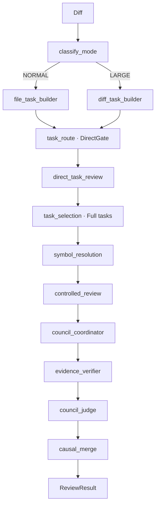
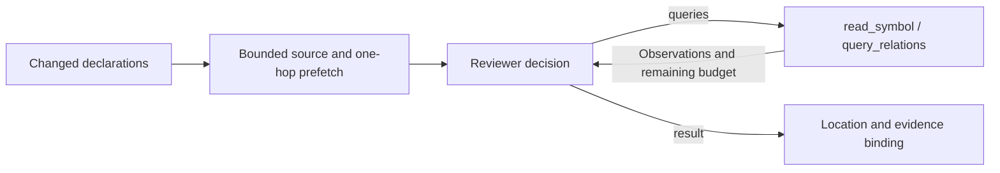

# Codeguard

[简体中文](README.md) | English

AI pull request review for security, behavioral, and maintainability risks, with GitHub Checks and pull request feedback.

Codeguard combines a Python Agent with a Java Gateway for controlled review orchestration, code facts, evidence verification, and GitHub integration.

## Features

- Security, behavioral, and maintainability review.
- Change-driven bounded ReAct with one unified reviewer.
- Java AST, symbol, and call-graph fact tools.
- Evidence Ledger, deterministic verification, and batched adjudication.
- Multi-provider routing, rate limiting, circuit breaking, retries, and fallback.
- GitHub Webhook, Check Run, annotations, and pull request comments.
- Job persistence, Prometheus metrics, and Docker Compose deployment.

## How It Works

```text
GitHub pull_request webhook
        |
        v
┌─ Java Gateway (single JVM, three services)────┐
│  CI Webhook (:8080)                            │
│    verify -> persist/dedup -> schedule ->      │
│    SHA workspace -> ProcessBuilder run Python  │
│  LLM Proxy (:9091)                             │
│    OpenAI-compatible → multi-provider route →  │
│    rate-limit/circuit-break/retry → fallback   │
│  Tool Server (:9090)                           │
│    file sandbox + AST + callers + sensitive API│
└────────────────────────────────────────────────┘
        |
        v
Python Agent
  PR size routing (normal/large) -> diff tasks -> task DirectGate
  -> SymbolResolution -> deterministic changed-declaration groups -> source preparation
  -> controlled review: one bounded reviewer per change group
  -> InvestigationResult (runtime-bound evidence references)
  -> deterministic candidate location -> evidence verification -> batched verdict
  LLM calls routed through LLM Proxy or direct to provider
        |
        v
GitHub Check Run, annotations, and pull request comments
```

The Python Agent owns review reasoning and orchestration. The Java Gateway is three independent services: LLM Proxy handles multi-provider routing and resilience (protocol forwarding, no semantic judgment), Tool Server collects deterministic code facts with file-access guardrails, and CI Webhook manages GitHub event ingestion and review job scheduling.

The default `controlled` path groups actual changed declarations (at most four per group), prepares bounded source pages, then lets the same reviewer read, query and produce candidates. It bypasses knowledge Plan, Summary, DirectTriage and model GraphPlan. The old multi-reviewer, planner, triage, summary and fixed-step execution paths have been removed; `direct` remains the tool-free baseline.

Each group has six exploration decisions and eight tool attempts, including preparation, plus at most one reserved conclusion. The task budget is 32 attempts. Source reads use at most half the allowance; source plus one-hop relation prefetch uses at most six attempts with the default budget, leaving at least two for dynamic investigation. Relation pages request up to six results and bounded endpoint excerpts, without automatically following cursors. Unqueried relations and page coverage remain explicit. Preparation shares the investigation deadline, while empty prefetched frontiers do not count as model looping. Source and graph tools admit only observed canonical IDs; member directories provide navigation without an additional full-class read. Tool payloads enter the evidence ledger unchanged.

The model interface contains assessment and queries/result, without historical triage metadata or observation receipts. A result can contain up to eight independent findings, each with at most three real observations. Patch-only findings need no arbitrary tool citation; runtime binds the patch automatically. Locations use verbatim added snippets or current-revision deletion anchors, with a file-level fallback and no extra location model call in the controlled path.

Unresolved questions, missing symbols and truncation remain incomplete even when other findings survive. Deterministic evidence verification establishes provenance and scope; the final Judge assesses the claim. This does not guarantee semantic correctness or exhaustive graph coverage. See [architecture and five-case validation](services/agent/ARCHITECTURE.md) for actual results and limitations.

### Agent workflow

`NORMAL` uses file tasks when the diff has at most 15 files and 60,000 characters. Exceeding either threshold selects `LARGE` and hunk tasks. Hunk count is reported but does not create another tier.

This diagram follows the actual outer LangGraph nodes. Direct and Full are task categories: Direct tasks are processed first, followed by selected Full tasks. Nodes with no matching tasks return without a model call.



| Node | Responsibility |
|---|---|
| `classify_mode` | Select file or hunk granularity from diff size, without an LLM. |
| `file_task_builder` / `diff_task_builder` | Build file / hunk tasks with changed lines and deletion anchors. |
| `task_route` | Deterministically route low-risk documentation/comment tasks to Direct and the remainder to Full. |
| `direct_task_review` | Review, locate and adjudicate only Direct tasks; retain their results separately. |
| `task_selection` | Select Full tasks and record large-diff coverage limits. |
| `symbol_resolution` | Resolve changed locations to real symbol IDs through the Gateway. |
| `controlled_review` | Group changed declarations, prefetch context, run bounded ReAct, locate candidates and bind evidence. |
| `council_coordinator` | Aggregate and consolidate candidates for verification. |
| `evidence_verifier` | Validate evidence integrity, revision, scope and graph contracts without an LLM; replay only recoverable failures. |
| `council_judge` | Adjudicate candidate support and severity in batches; no further tool investigation. |
| `causal_merge` | Analyze root causes, conservatively merge survivors and append Direct results. |

Inside `controlled_review`, deterministic grouping and bounded source/one-hop prefetch precede the same reviewer's query/result loop. Candidate location and evidence binding are runtime steps, not additional model planning nodes.



The model sees two tools: `read_symbol` for paginated source and `query_relations` for callers, callees, field readers/writers, implementations and overrides. `resolve_change_context` is runtime-only. Returned IDs permit further investigation; incomplete static analysis and exhausted budgets remain explicit limitations.

### Review prompts

The main prompt, [change-review.txt](services/agent/src/codeguard_agent/prompts/controlled/change-review.txt), is organized into role and objective, input and evidence boundaries, review decisions, tool use, termination conditions, and the output contract.

Supporting files in the [controlled prompt directory](services/agent/src/codeguard_agent/prompts/controlled) cover task scope, budget notices, exploration/conclusion phases, and error feedback. The bound schema defines structured fields; runtime code enforces budgets, timeouts, and termination. Splitting prompts into files adds no workflow nodes or model calls.

## Quick Start with Docker Compose

Prerequisites:

- Docker Engine with Docker Compose v2
- A GitHub App installed on the repositories to review
- A publicly reachable HTTPS endpoint for GitHub webhooks
- An API key for the configured LLM provider

Clone the repository, create the deployment configuration, and create the secrets directory:

```bash
git clone https://github.com/baiyun689/codeguard.git
cd codeguard
cp .env.example .env
mkdir -p secrets
```

PowerShell equivalents:

```powershell
git clone https://github.com/baiyun689/codeguard.git
Set-Location codeguard
Copy-Item .env.example .env
New-Item -ItemType Directory -Force secrets | Out-Null
```

Edit `.env` and set at least:

```dotenv
CODEGUARD_WEBHOOK_SECRET=replace-with-a-long-random-secret
CODEGUARD_GITHUB_APP_ID=123456
CODEGUARD_API_KEY=replace-with-your-provider-key
CODEGUARD_GITHUB_PRIVATE_KEY_FILE=./secrets/github-app.pem
```

Save the private key downloaded from GitHub as `./secrets/github-app.pem`. Compose mounts that file read-only and sets the in-container `CODEGUARD_GITHUB_PRIVATE_KEY_FILE` automatically.

Start the stable release. The default image is `ghcr.io/baiyun689/codeguard:latest`:

```bash
docker compose up -d
```

To run the continuously published `edge` image on Bash:

```bash
CODEGUARD_IMAGE_TAG=edge docker compose up -d
```

On PowerShell:

```powershell
$env:CODEGUARD_IMAGE_TAG = "edge"
docker compose up -d
```

To build from the current checkout instead of relying on a published image:

```bash
docker compose up -d --build
```

The CI webhook always listens on port `8080` inside the container; the internal Tool Server and LLM Proxy listen on `9090` and `9091`. Change only the host-side webhook port with `CODEGUARD_HOST_PORT`, for example:

```dotenv
CODEGUARD_HOST_PORT=8080
```

The mapped Gateway port serves plain HTTP and does not provide TLS. In production, terminate HTTPS at a reverse proxy and forward `/webhooks/github` to that host port; the public webhook URL should be `https://your-host.example/webhooks/github`. Do not point a GitHub webhook directly at the mapped port.

## Configure a GitHub App

1. In GitHub, open **Settings > Developer settings > GitHub Apps > New GitHub App**.
2. Set the webhook URL to `https://your-host.example/webhooks/github`.
3. Choose a webhook secret and put the identical value in `CODEGUARD_WEBHOOK_SECRET`.
4. Set these repository permissions:
   - **Checks:** Read and write
   - **Contents:** Read-only
   - **Pull requests:** Read and write
   - **Metadata:** Read-only (GitHub grants this permission automatically)
5. Under webhook events, subscribe to **Pull request**. Codeguard handles the `opened`, `reopened`, and `synchronize` actions.
6. Create the App, copy its **App ID** into `CODEGUARD_GITHUB_APP_ID`, generate a private key, and save it as `./secrets/github-app.pem`.
7. Install the App on each organization or repository that Codeguard should review.

Public repositories can be cloned without an additional token. For private repositories, set `CODEGUARD_GITHUB_TOKEN` in `.env` to a token that can read the repository contents. The current clone path does not automatically reuse the GitHub App installation token.

Your webhook endpoint must be reachable from GitHub over HTTPS. If Codeguard is behind a reverse proxy, forward `/webhooks/github` to the host port selected by `CODEGUARD_HOST_PORT`.

## Configure the LLM

### LLM Gateway mode (recommended)

All LLM calls route through the local LLM Proxy. The Python Agent holds no provider credentials:

```dotenv
CODEGUARD_PROVIDER=openai
CODEGUARD_API_BASE_URL=http://localhost:9091/v1
CODEGUARD_API_KEY=dummy            # Gateway does not validate on localhost; ChatOpenAI requires a non-empty value
CODEGUARD_MODEL=deepseek-chat      # or any model name; Gateway routes by model
```

The LLM Proxy reads multi-provider routing and resilience configuration from `llm-proxy-config.yml`, which is pre-configured in the Compose deployment.

### Direct mode

Bypass the Gateway and let the Python Agent call LLM providers directly:

```dotenv
CODEGUARD_PROVIDER=openai
CODEGUARD_MODEL=gpt-4o-mini
CODEGUARD_API_KEY=replace-with-your-key
```

For an OpenAI-compatible endpoint, also set:

```dotenv
CODEGUARD_API_BASE_URL=https://api.deepseek.com
CODEGUARD_STRUCTURED_METHOD=function_calling
```

Anthropic is available with `CODEGUARD_PROVIDER=claude`. `CODEGUARD_PROVIDER=mock` exercises the pipeline without a real model and is intended for development checks, not production review.

See [`.env.example`](.env.example) for all model, review-budget, and runtime settings.

## Verify the Deployment

Check container state and logs:

```bash
docker compose ps
docker compose logs -f codeguard
```

With the default host port:

```bash
curl --fail http://localhost:9090/health/ready
```

Then use the GitHub App settings page to send a test delivery, or open/update a pull request in an installed repository. A valid `pull_request` delivery is accepted asynchronously and should produce a Codeguard Check Run after review completes.

## Local CLI Usage

The Python Agent can review a local Git diff without GitHub:

```bash
cd services/agent
python -m venv .venv
source .venv/bin/activate
pip install -e .
export CODEGUARD_API_KEY=replace-with-your-key
python -m codeguard_agent review --repo /path/to/repository --base HEAD
```

PowerShell:

```powershell
Set-Location services/agent
python -m venv .venv
.\.venv\Scripts\Activate.ps1
pip install -e .
$env:CODEGUARD_API_KEY = "replace-with-your-key"
python -m codeguard_agent review --repo C:\path\to\repository --base HEAD
```

Set `CODEGUARD_PROVIDER=mock` for a zero-cost pipeline smoke test. Configure `CODEGUARD_TOOL_SERVER_URL=http://localhost:9090` when the local Agent should use a separately running Gateway for repository context tools.

The Tool Server builds a revision-scoped Java snapshot with ASTs, a symbol index, and lazily resolved semantic relationships. The Agent reads bounded source pages and typed call/field/override relationships. Source pages expose real member IDs; optional @Override annotations are not required to resolve inherited method relationships. Interface calls remain distinct from concrete implementation calls. Tool facts enter the Evidence Ledger and are visible in Trace alongside investigation outcomes and token usage. Internal LLM calls are non-streaming; request timeouts and a cooperative investigation deadline prevent new requests after expiry.

## Configuration

Deployment settings:

| Variable | Default | Purpose |
|---|---|---|
| `CODEGUARD_IMAGE_TAG` | `latest` | Image tag under `ghcr.io/baiyun689/codeguard` |
| `CODEGUARD_HOST_PORT` | `9090` | Host port mapped to the container's CI webhook port `8080` |
| `CODEGUARD_TOOL_HOST_PORT` | `9092` | Loopback-only host port mapped to the container's Tool Server port `9090` |
| `CODEGUARD_TOOL_SERVER_TOKEN` | required | Shared internal token for the Python Agent and Tool Server |
| `CODEGUARD_TOOL_ALLOWED_ROOTS` | fixed by Compose | Comma-separated parent directories allowed to create Git workspace sessions |
| `CODEGUARD_WEBHOOK_SECRET` | required | Secret used to verify GitHub webhook signatures |
| `CODEGUARD_GITHUB_APP_ID` | required | GitHub App ID used for installation authentication |
| `CODEGUARD_GITHUB_PRIVATE_KEY_FILE` | `./secrets/github-app.pem` | Host path to the App private key mounted by Compose |
| `CODEGUARD_GITHUB_TOKEN` | empty | Repository read token required for private repository clones |
| `CODEGUARD_PROVIDER` | `openai` | LLM provider: `openai`, `claude`, or `mock` |
| `CODEGUARD_MODEL` | provider default | Model name |
| `CODEGUARD_API_KEY` | required by Compose | LLM provider API key |
| `CODEGUARD_API_BASE_URL` | empty | Optional compatible API endpoint |
| `CODEGUARD_MAX_CONCURRENT_REVIEWS` | `2` | Maximum reviews run concurrently in this instance |
| `CODEGUARD_REVIEW_TIMEOUT_SECONDS` | `600` | Python review process timeout |
| `CODEGUARD_RETRY_DELAY_SECONDS` | `30` | Delay before a retryable job is rescheduled |
| `CODEGUARD_SHUTDOWN_GRACE_SECONDS` | `30` | Maximum drain time during shutdown |
| `CODEGUARD_WEBHOOK_RATE_LIMIT` | `0.5` | Accepted webhook requests per second; `0` disables rate limiting |
| `CODEGUARD_GRAPH_CACHE_MAX_SNAPSHOTS` | `4` | Maximum complete project snapshots retained across sessions |
| `CODEGUARD_GRAPH_CACHE_TTL_MINUTES` | `30` | Snapshot expiry after last access |
| `CODEGUARD_GRAPH_BUILD_TIMEOUT_SECONDS` | `120` | Full-project AST and semantic graph build timeout |

Compose sets container-only paths and ports for the bundled deployment. Do not change `CODEGUARD_CI_PORT`, `CODEGUARD_TOOL_SERVER_PORT`, `CODEGUARD_TOOL_SERVER_URL`, `CODEGUARD_LLM_PROXY_PORT`, `CODEGUARD_JOB_DB_URL`, or `CODEGUARD_WORKSPACE_DIR` unless you are maintaining a custom deployment.

## Operations and Observability

Codeguard currently supports a single Gateway instance. MySQL persistence and the scheduler recover jobs within that instance, but the deployment does not implement multi-instance leader election, distributed locking, or shared-workspace coordination. Do not scale the Compose service above one replica.

The Java Gateway runs three services on separate ports within a single JVM:

| Service | Default Port | Purpose |
|---|---|---|
| CI Webhook | 8080 | GitHub webhook ingestion + review scheduling |
| Tool Server | 9090 | Agent tool service + file sandbox |
| LLM Proxy | 9091 | OpenAI-compatible LLM gateway |

Operational endpoints (available on all three services for `/health` and `/health/live`):

| Endpoint | Meaning |
|---|---|
| `GET /health` | Compatibility health endpoint; reports process liveness |
| `GET /health/live` | Liveness probe |
| `GET /health/ready` | CI service: readiness of MySQL (connection ping), the scheduler, and Python initialization; returns `503` when unavailable |
| `GET /metrics` | Prometheus text exposition (CI, Tool Server, and LLM Proxy) |

Compose persists MySQL job data in the `mysql-data` volume (standalone MySQL container) and temporary SHA-scoped review workspaces in `job-workspaces`. Stop the service with `docker compose down`. Add `--volumes` only when you intentionally want to delete persisted job state and workspaces.

The image publishing workflow uses:

- `edge` for pushes to `master`
- semantic version tags such as `v1.2.3` for release images
- `latest` for the newest semantic version

After the package is published to GHCR for the first time, a repository owner may need to open the package settings on GitHub and change its visibility to **Public** before unauthenticated `docker compose up -d` can pull it.

## Development

Python checks:

```bash
cd services/agent
uv sync --group dev
uv run pytest tests/ -q
uv run ruff check src/
uv run mypy src/
```

Java checks:

```bash
cd services/gateway
mvn --batch-mode verify    # Builds all 4 submodules: shared, tool-server, ci-webhook, llm-proxy
```

Container build:

```bash
docker build -t codeguard:local .
```

Real quality evaluation currently uses 15 selected real Java repositories in `selected-20-v2`; each case's `expected` file is the formal ground truth, while hunk-level diagnostics are auxiliary. Evidence metadata in the expected cases is retained only for compatibility. The Codeguard report's `root_cause` and `evidence_locations` remain available to the optional case-level semantic judge, but evidence is not scored as a separate evaluation dimension. Profiles cover direct review, graph-backed evidence, and the change-driven bounded ReAct workflow. Recall, Precision, F1, and stability must be read from the corresponding evaluation reports rather than treated as fixed product claims. See [`services/agent/evals/README.md`](services/agent/evals/README.md).

## Contributing

Issues and pull requests are welcome. Keep changes focused, add deterministic tests for code changes, and run the relevant Python, Java, and container checks before submitting.

Commit messages use Conventional Commits:

```text
<type>(<scope>): <description>
<type>: <description>
```

The `scope` is optional. Common types are `feat`, `fix`, `docs`, `refactor`, `test`, and `chore`.

## License

Codeguard is available under the [MIT License](LICENSE).
