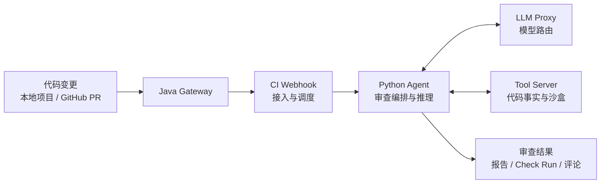
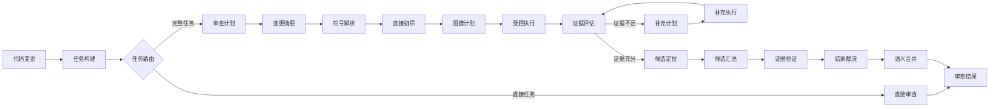

# Codeguard

简体中文 | [English](README.en.md)

AI Pull Request 代码审查系统，支持安全、行为正确性和可维护性检查，并通过 GitHub Checks 和 PR 评论反馈结果。

Codeguard 由 Python Agent 和 Java Gateway 组成，提供受控审查编排、代码事实分析、证据验证和 GitHub 集成能力。

## 功能特性

- 安全、行为正确性和可维护性三维度审查。
- 基于 Plan-and-Execute 的任务级受控审查流程。
- 基于 Java AST、符号和调用图的代码事实工具。
- Evidence Ledger、确定性证据验证和批量结果裁决。
- 多模型路由、限流、熔断、重试和故障降级。
- GitHub Webhook、Check Run、行级标注和 PR 评论集成。
- 任务持久化、Prometheus 指标和 Docker Compose 部署。

## 工作原理

Codeguard 由 Java Gateway 和 Python Agent 组成。Java 负责请求接入、任务调度和确定性代码工具；Python 负责任务级 Plan-and-Execute 编排、证据验证和结果裁决。

### 整体架构



模块职责：

- **CI Webhook**：接收 GitHub 事件，创建和调度审查任务。
- **Python Agent**：拆分审查任务，执行 Plan-and-Execute 受控审查，并完成证据验证与结果裁决。
- **LLM Proxy**：统一管理模型访问和提供商路由。
- **Tool Server**：在沙盒内提供文件、符号、AST 和调用关系等代码事实。

### Agent 审查工作流



节点职责：

- **任务构建**：按照变更规模生成审查任务。
- **任务路由**：确定任务进入 Direct 或 Full 流程。
- **审查计划**：为完整任务路由知识主题，不负责选择审查维度；三类固定审查维度均执行。
- **直接初筛**：从安全、运行行为和可维护性三个角度提出候选问题。
- **图谱计划**：为需要查证的候选生成工具、符号和查询顺序。
- **受控执行**：按候选逐步执行有界工具计划，使用初始预算、Delta 预算、路径深度和调用缓存，工具结果进入证据账本。
- **证据评估**：结合 patch、源码和图谱事实判断当前 WorkItem 是否满足证明条件；只对明确缺口请求一次补充计划，第二次仍不足则丢弃该图谱候选。
- **补充计划 / 补充执行**：GraphPlan 只从本候选首轮投影已暴露的 symbol 中选择一个新步骤，不能新增候选、跨任务或恢复自由探索；补充调用共享 Delta 预算。
- **候选定位**：校验问题是否准确对应本次新增代码。
- **候选汇总**：汇集并规范化各审查维度的发现。
- **证据验证**：检查候选引用的代码和工具事实是否真实可用。
- **结果裁决**：根据候选和证据判断保留、丢弃及严重程度。
- **语义合并**：合并语义相同的重复问题，不跨独立机制合并。

本地审查输出 Markdown 报告和 HTML Trace；GitHub App 审查则进一步将结果回写到 Check Run、行内标注和 PR 评论。

## 使用 Docker Compose 快速开始

准备条件：

- Docker Engine 和 Docker Compose v2
- 已安装到待审查仓库的 GitHub App
- GitHub 能访问的公网 HTTPS Webhook 地址
- 所配置 LLM 服务商的 API Key

克隆仓库、创建部署配置和密钥目录：

```bash
git clone https://github.com/baiyun689/codeguard.git
cd codeguard
cp .env.example .env
mkdir -p secrets
```

PowerShell：

```powershell
git clone https://github.com/baiyun689/codeguard.git
Set-Location codeguard
Copy-Item .env.example .env
New-Item -ItemType Directory -Force secrets | Out-Null
```

编辑 `.env`，至少填写：

```dotenv
CODEGUARD_WEBHOOK_SECRET=replace-with-a-long-random-secret
CODEGUARD_GITHUB_APP_ID=123456
CODEGUARD_API_KEY=replace-with-your-provider-key
CODEGUARD_GITHUB_PRIVATE_KEY_FILE=./secrets/github-app.pem
```

将 GitHub 下载的 App 私钥保存为 `./secrets/github-app.pem`。Compose 会以只读方式挂载该文件，并自动设置容器内的 `CODEGUARD_GITHUB_PRIVATE_KEY_FILE`。

启动稳定版本。默认镜像为 `ghcr.io/baiyun689/codeguard:latest`：

```bash
docker compose up -d
```

在 Bash 中运行持续发布的 `edge` 镜像：

```bash
CODEGUARD_IMAGE_TAG=edge docker compose up -d
```

PowerShell：

```powershell
$env:CODEGUARD_IMAGE_TAG = "edge"
docker compose up -d
```

从当前源码构建并启动，而不是拉取已发布镜像：

```bash
docker compose up -d --build
```

启动完整可观测性栈：

```bash
docker compose --profile observability up -d --build
```

启动后访问 `http://localhost:3000`。Grafana 会自动加载 Prometheus 数据源和
**Codeguard · Review & LLM Operations** 看板；匿名用户可只读查看，管理员默认账号为
`admin / codeguard`，公开部署前应通过 `GRAFANA_ADMIN_USER` 和
`GRAFANA_ADMIN_PASSWORD` 修改，并设置 `GRAFANA_ANONYMOUS_ENABLED=false`。
Prometheus 位于 `http://localhost:9093`。

看板覆盖三类信号：

- 审查管线：活动任务、成功率、吞吐和 P95 耗时；
- AST / Evidence 工具：按工具与结果统计调用速率；
- LLM 韧性：按 Provider 呈现调用量、P95 耗时、重试、fallback 和熔断器状态。

`ops/prometheus/alerts.yml` 预置服务不可用、审查失败率、慢审查、工具错误率、
LLM 失败率和熔断器开路告警规则。Prometheus 默认保留 15 天数据；Grafana 与
Prometheus 数据均使用命名卷持久化。

### 本地 Web 审查界面

启动 `codeguard` 服务后，可访问 `http://localhost:8501` 打开本地审查界面。
在界面中填写宿主机上的 Git 项目根目录，选择 Diff 基线后即可开始审查。界面默认使用完整的 `controlled` 受控审查管线；摘要、代码图谱、Evidence Ledger、Judge
和语义合并不会被拆成相互独立的开关；报告和 Agent Trace
作为展示选项提供。

```powershell
docker compose up -d --build codeguard
# 浏览器打开 http://localhost:8501
```

在 `.env` 中设置项目父目录，Docker 会将它挂载到 UI：

```dotenv
CODEGUARD_PROJECTS_DIR=E:/workspace/review-projects
```

例如填写 `E:\\workspace\\demo-project`。项目最好保留 Git 历史，
这样可以从下拉框选择 `HEAD`、`main` 或其他本地分支作为 Diff 基线。

容器内用于接收 GitHub Webhook 的 CI 服务固定监听 `8080`；Tool Server 与 LLM Proxy
分别监听内部端口 `9090` 和 `9091`。Webhook 通过 `CODEGUARD_HOST_PORT` 发布；
Tool Server 仅绑定宿主机回环地址，通过 `CODEGUARD_TOOL_HOST_PORT` 提供给本机
Python Agent：

```dotenv
CODEGUARD_HOST_PORT=8080
CODEGUARD_TOOL_HOST_PORT=9092
# 随机长字符串；本机 Agent 连接 Tool Server 时也必须使用同一值。
CODEGUARD_TOOL_SERVER_TOKEN=请自行生成随机值
```

Tool Server 不应暴露到公网；即使仅绑定回环地址，所有工具请求仍必须携带
`X-Codeguard-Tool-Token`。Gateway 的 Webhook 映射端口提供明文 HTTP，不直接提供
TLS。生产环境必须由反向代理终止 HTTPS，并将 `/webhooks/github` 转发到该宿主机端口；
公开 Webhook 地址应为 `https://your-host.example/webhooks/github`。不要将 GitHub
Webhook 直接指向映射端口。

## 项目展示

下面展示一次本地审查和一次 GitHub App 审查的主要产物。

### 本地审查界面

通过 Web UI 填写待审查项目根目录、选择 Diff 基线，并选择是否生成 Markdown 报告和 Agent Trace。


### Agent Trace

Trace 展示 LangGraph 主执行流、Task 路由、Plan、SymbolResolution、三类审查维度、受控 DirectTriage/GraphPlan/Execute、
证据验证、Judge 和语义合并，并可展开查看工具调用、预算、证据引用与节点输入输出。


### Markdown 审查报告

本地审查完成后可以生成 Markdown 报告，按严重级别、问题类型、文件和行号汇总最终保留的问题。

示例报告：[review-report-example.md](docs/showcase/review-report-example.md)

### GitHub App 审查结果

GitHub App 接收 Pull Request Webhook 后，会将审查结果回写到 Check Run，并在变更文件对应位置发布行内评论；无法精确定位的问题会进入汇总结果。


## 配置 GitHub App

1. 在 GitHub 打开 **Settings > Developer settings > GitHub Apps > New GitHub App**。
2. 将 Webhook URL 设置为 `https://your-host.example/webhooks/github`。
3. 创建 Webhook Secret，并将相同值写入 `CODEGUARD_WEBHOOK_SECRET`。
4. 设置以下 Repository permissions：
   - **Checks：** Read and write
   - **Contents：** Read-only
   - **Pull requests：** Read and write
   - **Metadata：** Read-only（GitHub 会自动授予）
5. 在 Webhook events 中订阅 **Pull request**。Codeguard 会处理 `opened`、`reopened` 和 `synchronize` 事件。
6. 创建 App，将 **App ID** 写入 `CODEGUARD_GITHUB_APP_ID`，生成私钥并保存到 `./secrets/github-app.pem`。
7. 将 App 安装到需要 Codeguard 审查的组织或仓库。

公开仓库不需要额外 Token 即可克隆。私有仓库需要在 `.env` 中设置具有仓库内容读取权限的 `CODEGUARD_GITHUB_TOKEN`；当前克隆流程不会自动复用 GitHub App installation token。

Webhook 端点必须能通过 HTTPS 被 GitHub 访问。如果 Codeguard 位于反向代理后，请将 `/webhooks/github` 转发到 `CODEGUARD_HOST_PORT` 指定的宿主机端口。

## 配置 LLM

### LLM Gateway 模式（推荐）

所有 LLM 调用经本地 LLM Proxy 统一路由，Python Agent 无需持有提供商密钥：

```dotenv
CODEGUARD_PROVIDER=openai
CODEGUARD_API_BASE_URL=http://localhost:9091/v1
CODEGUARD_API_KEY=dummy           # Gateway localhost 不验证，但 ChatOpenAI 要求非空
CODEGUARD_MODEL=deepseek-chat     # 或其他 model 名，Gateway 按 model 路由
```

LLM Proxy 通过 `llm-proxy-config.yml` 配置多提供商路由和韧性策略。Compose 部署时该配置已内置。

### 直连模式

绕过 Gateway，Python Agent 直连 LLM 提供商：

```dotenv
CODEGUARD_PROVIDER=openai
CODEGUARD_MODEL=gpt-4o-mini
CODEGUARD_API_KEY=replace-with-your-key
```

使用 OpenAI 兼容接口时，还需设置：

```dotenv
CODEGUARD_API_BASE_URL=https://api.deepseek.com
CODEGUARD_STRUCTURED_METHOD=function_calling
```

设置 `CODEGUARD_PROVIDER=claude` 可使用 Anthropic。设置 `CODEGUARD_PROVIDER=mock` 可在不调用真实模型的情况下验证管线，仅适合开发检查，不应作为生产审查模式。

全部模型、审查预算和运行参数参见 [`.env.example`](.env.example)。

## 验证部署

检查容器状态和日志：

```bash
docker compose ps
docker compose logs -f codeguard
```

使用默认宿主机端口检查就绪状态：

```bash
curl --fail http://localhost:9090/health/ready
```

随后可在 GitHub App 设置页发送测试 Delivery，或在已安装 App 的仓库中创建、更新 Pull Request。有效的 `pull_request` 事件会被异步接收，审查结束后将生成 Codeguard Check Run。

## 本地 CLI 使用

Python Agent 可直接审查本地 Git Diff，无需接入 GitHub：

```bash
cd services/agent
python -m venv .venv
source .venv/bin/activate
pip install -e .
export CODEGUARD_API_KEY=replace-with-your-key
python -m codeguard_agent review --repo /path/to/repository --base HEAD
```

PowerShell：

```powershell
Set-Location services/agent
python -m venv .venv
.\.venv\Scripts\Activate.ps1
pip install -e .
$env:CODEGUARD_API_KEY = "replace-with-your-key"
python -m codeguard_agent review --repo C:\path\to\repository --base HEAD
```

设置 `CODEGUARD_PROVIDER=mock` 可进行零成本管线冒烟测试。如果本地 Agent 需要通过独立运行的 Gateway 获取仓库上下文工具，请设置 `CODEGUARD_TOOL_SERVER_URL=http://localhost:9090`。

加 `--report` 参数可在审查结束后于 `<repo>/reports/` 生成带时间戳的 Markdown 报告（severity 统计 + 按严重级分组的问题列表 + diff 代码片段）。GitHub App 的 CI 模式结果走 Check Runs，不生成本地报告。

## 配置项

部署配置：

| 变量 | 默认值 | 用途 |
|---|---|---|
| `CODEGUARD_IMAGE_TAG` | `latest` | `ghcr.io/baiyun689/codeguard` 下的镜像标签 |
| `CODEGUARD_HOST_PORT` | `9090` | 映射到容器 CI Webhook 端口 `8080` 的宿主机端口 |
| `CODEGUARD_TOOL_HOST_PORT` | `9092` | 仅绑定 `127.0.0.1`、映射到容器 Tool Server 端口 `9090` 的宿主机端口 |
| `CODEGUARD_TOOL_SERVER_TOKEN` | 必填 | Python Agent 与 Tool Server 的内部共享 Token |
| `CODEGUARD_TOOL_ALLOWED_ROOTS` | Compose 固定 | 可创建工具会话的 Git 工作区父目录，逗号分隔 |
| `CODEGUARD_WEBHOOK_SECRET` | 必填 | 校验 GitHub Webhook 签名的 Secret |
| `CODEGUARD_GITHUB_APP_ID` | 必填 | 用于 installation 认证的 GitHub App ID |
| `CODEGUARD_GITHUB_PRIVATE_KEY_FILE` | `./secrets/github-app.pem` | Compose 挂载的 App 私钥宿主机路径 |
| `CODEGUARD_GITHUB_TOKEN` | 空 | 克隆私有仓库所需的仓库读取 Token |
| `CODEGUARD_PROVIDER` | `openai` | LLM 服务商：`openai`、`claude` 或 `mock` |
| `CODEGUARD_MODEL` | 服务商默认值 | 模型名称 |
| `CODEGUARD_API_KEY` | Compose 中必填 | LLM 服务商 API Key |
| `CODEGUARD_API_BASE_URL` | 空 | 可选的兼容 API 地址 |
| `CODEGUARD_MAX_CONCURRENT_REVIEWS` | `2` | 当前实例允许并发执行的最大审查数 |
| `CODEGUARD_REVIEW_TIMEOUT_SECONDS` | `600` | Python 审查进程超时时间 |
| `CODEGUARD_RETRY_DELAY_SECONDS` | `30` | 可重试任务重新调度前的等待时间 |
| `CODEGUARD_SHUTDOWN_GRACE_SECONDS` | `30` | 停机时等待活动任务结束的最长时间 |
| `CODEGUARD_WEBHOOK_RATE_LIMIT` | `0.5` | 每秒接收的 Webhook 请求数；`0` 表示关闭限流 |
| `CODEGUARD_GRAPH_CACHE_MAX_SNAPSHOTS` | `4` | 跨会话保留的完整项目快照上限 |
| `CODEGUARD_GRAPH_CACHE_TTL_MINUTES` | `30` | 项目快照访问后过期时间 |
| `CODEGUARD_GRAPH_BUILD_TIMEOUT_SECONDS` | `120` | 全项目 AST 与语义图构建超时 |
| `CODEGUARD_DISCOVERY_MODE` | `controlled` | 受控审查模式：`controlled`（Plan-and-Execute） |
| `CODEGUARD_CONTROLLED_INITIAL_TOOL_BUDGET` | `6` | controlled 每 task 初始工具调用预算 |
| `CODEGUARD_CONTROLLED_DELTA_TOOL_BUDGET` | `2` | controlled 每 task Delta 工具调用预算 |
| `CODEGUARD_CONTROLLED_MAX_PATH_DEPTH` | `3` | controlled 路径最大深度（最大 3） |
| `CODEGUARD_CONTROLLED_MAX_SEEDS_PER_CHANGE_UNIT` | `4` | 每个变更单元保留的初筛候选上限 |
| `CODEGUARD_CONTROLLED_MAX_SEEDS_PER_REVIEWER` | `4` | 每个 reviewer/task 保留的初筛候选上限 |
| `CODEGUARD_CONTROLLED_MAX_SEEDS_PER_TASK` | `12` | 每个 task 的初筛候选硬上限 |
| `CODEGUARD_CONTROLLED_MAX_KNOWLEDGE_TOPICS` | `4` | 每 task 知识主题上限 |
| `CODEGUARD_CONTROLLED_EXECUTE_CONCURRENCY` | `3` | controlled 同一 task 内独立证据步骤的最大并发数；`1` 为串行 |
| `CODEGUARD_TOOL_SERVER_PROJECT_ROOT` | 空 | 宿主 Agent 连接 Docker Gateway 时的容器项目根路径（Compose 通常为 `/workspace/projects`） |

Compose 会设置打包部署所需的容器内部路径和端口，并在未显式设置时将
`CODEGUARD_API_BASE_URL` 指向容器内的 LLM Proxy。除非维护自定义部署，否则不要修改
`CODEGUARD_CI_PORT`、`CODEGUARD_TOOL_SERVER_PORT`、`CODEGUARD_TOOL_SERVER_URL`、
`CODEGUARD_LLM_PROXY_PORT`、`CODEGUARD_JOB_DB_URL` 或 `CODEGUARD_WORKSPACE_DIR`。

## 运维与可观测性

Codeguard 当前只支持单 Gateway 实例。MySQL 持久化和调度器可以在该实例内恢复任务，但尚未实现多实例选主、分布式锁或共享工作区协调。不要将 Compose 服务扩容到一个以上副本。

Java Gateway 三个服务各监听独立端口：

| 服务 | 默认端口 | 用途 |
|---|---|---|
| CI Webhook | 8080 | GitHub Webhook 接入 + 审查调度 |
| Tool Server | 9090 | Agent 工具服务 + 文件沙箱 |
| LLM Proxy | 9091 | OpenAI 兼容 LLM 代理 |

运维端点（所有服务均提供 `/health` 和 `/health/live`）：

| 端点 | 含义 |
|---|---|
| `GET /health` | 兼容健康检查端点，报告进程存活状态 |
| `GET /health/live` | 存活探针 |
| `GET /health/ready` | CI 服务：检查 MySQL（连接 ping）、调度器和 Python 初始化状态；不可用时返回 `503` |
| `GET /metrics` | Prometheus 文本格式指标（CI、Tool Server 和 LLM Proxy 均提供） |

Compose 将 MySQL 任务数据持久化到 `mysql-data` 卷（独立 MySQL 容器），将按 SHA 隔离的临时审查工作区保存到 `job-workspaces`。使用 `docker compose down` 停止服务；只有在明确需要删除持久化任务状态和工作区时才添加 `--volumes`。

镜像发布规则：

- 推送到 `master` 时发布 `edge`
- `v1.2.3` 等语义化版本标签发布稳定镜像
- 最新语义化版本同时发布为 `latest`

GHCR 首次发布镜像后，仓库所有者可能需要在 GitHub Package 设置中手动将可见性改为 **Public**，否则未认证用户无法通过 `docker compose up -d` 拉取镜像。

## 开发

Python 检查：

```bash
cd services/agent
uv sync --group dev
uv run pytest tests/ -q
uv run ruff check src/
uv run mypy src/
```

Java 检查：

```bash
cd services/gateway
mvn --batch-mode verify     # 构建全部四个子模块：shared、tool-server、ci-webhook、llm-proxy
```

容器构建：

```bash
docker build -t codeguard:local .
```

真实质量评测使用 `selected-20-v2` 当前启用的 15 个精选真实 Java 仓库；正式标答以各 case 的 `expected` 为准，另有
`planted-bugs.diff` 生成的 hunk 诊断记录用于辅助分析。评测 profile 覆盖 direct、代码图谱和
Plan-and-Execute 受控发现，具体 Recall、Precision、F1 与稳定性结果以评测报告为准。评测框架、profile 定义与报告见
[`services/agent/evals/README.md`](services/agent/evals/README.md)。

## 参与贡献

欢迎提交 Issue 和 Pull Request。代码改动应保持聚焦、添加确定性测试，并在提交前运行相应的 Python、Java 和容器检查。

Commit Message 使用 Conventional Commits：

```text
<type>(<scope>): <description>
<type>: <description>
```

`scope` 可选。常用类型包括 `feat`、`fix`、`docs`、`refactor`、`test` 和 `chore`。

## 许可证

Codeguard 使用 [MIT License](LICENSE)。
